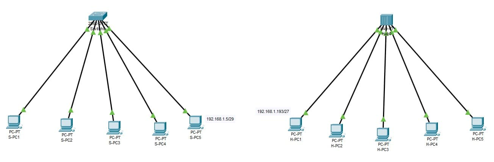
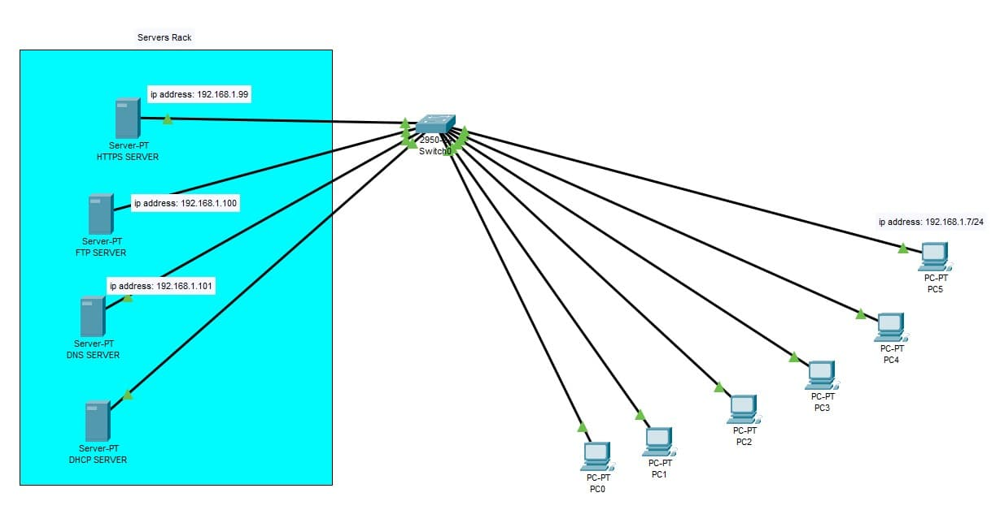
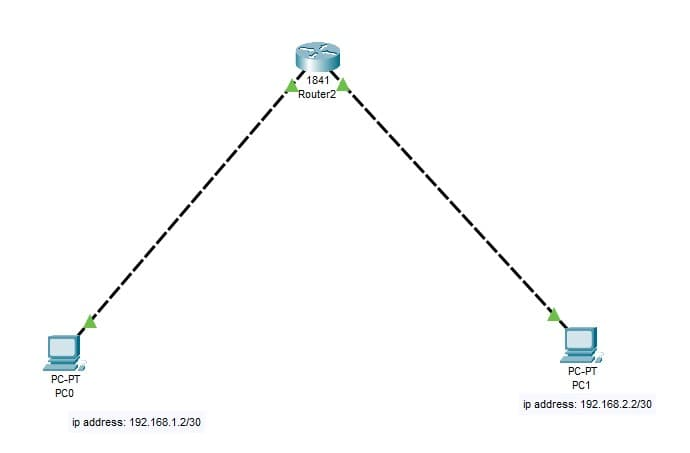
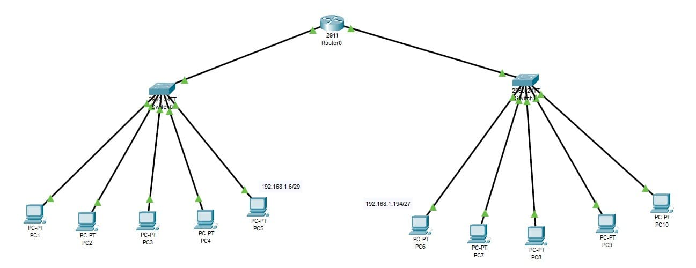
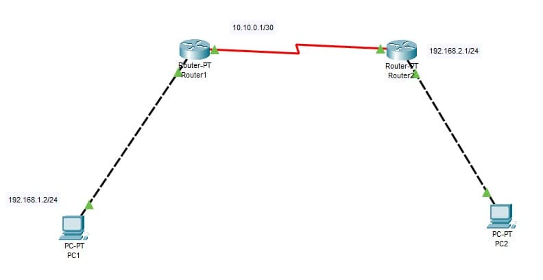
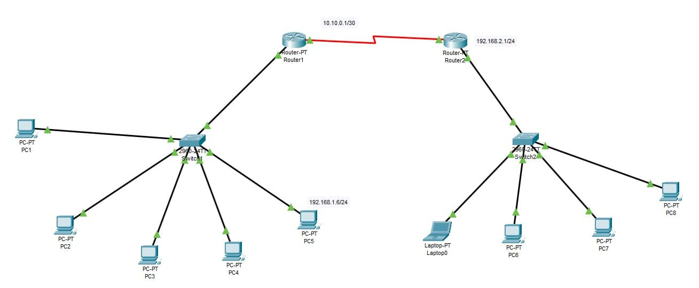
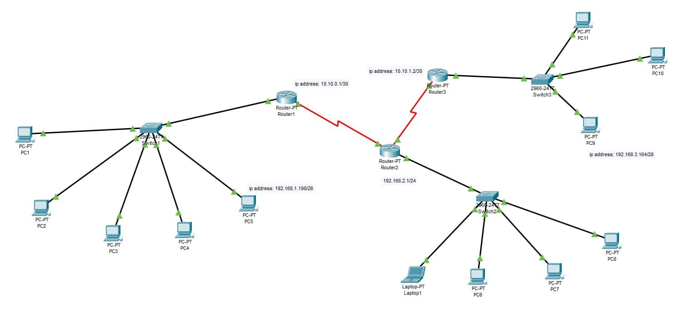

# Networking Exercises

---

## Exercise 1 — RJ-45 Cable

An **RJ-45** (Registered Jack 45) is the standard 8-pin connector used in Ethernet networking. It's the plug/socket you see at the end of most network cables — connecting computers, switches, routers, and other network devices.

The cable itself contains 8 copper wires (4 pairs), and the connector has 8 positions (pins), which is why it's also called an **8P8C** connector.

### Straight-Through vs. Crossover

The difference lies in how the 8 wires are mapped between the two ends of the cable.

| Type | Wire Mapping | Used For |
|---|---|---|
| **Straight-Through** | Same order on both ends (T568A↔T568A or T568B↔T568B) | Connecting **different** device types: PC → Switch, Switch → Router |
| **Crossover** | Ends use different standards (T568A↔T568B) | Connecting **same** device types: PC → PC, Switch → Switch |

> **Modern Note:** Most modern network cards and switches support **Auto-MDI/MDIX**, which automatically detects and corrects the cable type, making crossover cables largely obsolete.

---

## Exercise 2 — Hub vs. Switch

### What is a Hub?

A hub is a simple, "dumb" Layer 1 device. When it receives data on one port, it:

1. Repeats (regenerates) the signal
2. Sends it out to **every** other port (except the one it came from)

```
PC1 sends to PC2:

PC1 → Hub → PC2 ✅ (receives it)
          → PC3 ✅ (receives it too — unintended)
          → PC4 ✅ (receives it too — unintended)
```

This creates a single **collision domain** — all devices share the same bandwidth, and simultaneous transmissions cause collisions.

### What is a Switch?

A switch is a smart **Layer 2** device. It:

1. Learns which device is connected to which port by reading **MAC addresses**
2. Builds a **CAM table** (Content Addressable Memory) that maps MAC addresses to ports
3. Sends data **only** to the port where the destination device is connected

```
PC1 sends to PC2:

PC1 → Switch → PC2 ✅ (receives it)
             → PC3 ❌ (does NOT receive it)
             → PC4 ❌ (does NOT receive it)
```

Each port on a switch is its own **collision domain**, which dramatically improves performance.

### Hub vs. Switch — Summary

| Feature | Hub | Switch |
|---|---|---|
| OSI Layer | Layer 1 (Physical) | Layer 2 (Data Link) |
| Intelligence | None (dumb repeater) | Smart (MAC address learning) |
| Traffic | Broadcasts to all ports | Sends only to destination port |
| Collision Domain | One shared domain | One domain per port |
| Bandwidth | Shared among all devices | Dedicated per connection |
| Security | Low (all traffic visible to all) | Higher (traffic isolated per port) |

### Packet Tracer Topology



The left topology uses a **Switch** (Switch0) with 5 PCs (S-PC1 to S-PC5). The rightmost PC (S-PC5) has the address `192.168.1.5/29`.

The right topology uses a **Hub** (Hub0) with 5 PCs (H-PC1 to H-PC5). The leftmost PC (H-PC1) has the address `192.168.1.193/27`.

---

## Exercise 3 — OSI Model

The **OSI Model** (Open Systems Interconnection) is a conceptual framework that standardizes how different network systems communicate. It divides networking into **7 layers**, each with a specific role.

| Layer | Name | Role | Example Protocols/Devices |
|---|---|---|---|
| 7 | **Application** | Interface for end-user applications | HTTP, HTTPS, FTP, DNS, DHCP |
| 6 | **Presentation** | Data formatting, encryption, compression | SSL/TLS, JPEG, ASCII |
| 5 | **Session** | Manages sessions between applications | NetBIOS, RPC |
| 4 | **Transport** | End-to-end communication, error checking | TCP, UDP |
| 3 | **Network** | Logical addressing and routing | IP, Router |
| 2 | **Data Link** | MAC addressing, frame delivery | Ethernet, Switch |
| 1 | **Physical** | Raw bit transmission over media | Cables, Hub, RJ-45 |

### Where Do Our Devices Operate?

- **Hub** → Layer 1 (Physical) — simply repeats electrical signals
- **Switch** → Layer 2 (Data Link) — uses MAC addresses
- **Router** → Layer 3 (Network) — uses IP addresses

### Packet Tracer Topology — Services Network



This topology demonstrates a network with a centralized **Servers Rack** containing four servers, all connected via a **Switch** to client PCs.

| Server | IP Address | Purpose |
|---|---|---|
| HTTPS SERVER | 192.168.1.99 | Serves secure web pages (HTTPS only; HTTP disabled) |
| FTP SERVER | 192.168.1.100 | File Transfer Protocol service |
| DNS SERVER | 192.168.1.101 | Resolves domain names to IP addresses |
| DHCP SERVER | *(static)* | Assigns IP addresses automatically to all PCs |

All servers use **static IP addresses** (manually configured) so their addresses never change — essential for reliable service delivery.

The **DHCP server** assigns IP addresses to all PCs (PC0–PC5) dynamically. The one IP visible in the diagram (`192.168.1.7/24` on PC5) is an example of a DHCP-assigned address.

### Protocols & Services Reference

#### Server
A **server** is a device (or software) that provides resources, data, or services to other devices (clients) on the network. Servers run continuously and respond to client requests.

#### DHCP — Dynamic Host Configuration Protocol
- **Layer:** 7 (Application) | **Port:** 67 (server), 68 (client) | **Transport:** UDP
- DHCP automatically assigns IP addresses, subnet masks, default gateways, and DNS server addresses to clients.
- **How it works (DORA process):**
  1. **Discover** — Client broadcasts "I need an IP address"
  2. **Offer** — DHCP server replies with an available IP offer
  3. **Request** — Client accepts and requests the offered IP
  4. **Acknowledge** — Server confirms the assignment

#### DNS — Domain Name System
- **Layer:** 7 (Application) | **Port:** 53 | **Transport:** UDP (or TCP for large responses)
- DNS translates human-readable domain names (e.g., `www.example.com`) into IP addresses (e.g., `192.168.1.99`).
- **Common DNS Record Types:**

| Record | Purpose | Example |
|---|---|---|
| **A** | Maps a domain to an IPv4 address | `server.local → 192.168.1.99` |
| **AAAA** | Maps a domain to an IPv6 address | `server.local → ::1` |
| **CNAME** | Alias pointing to another domain | `www → server.local` |
| **MX** | Mail server for a domain | `mail.local` |
| **NS** | Authoritative name server | `ns1.local` |
| **PTR** | Reverse lookup (IP → name) | `192.168.1.99 → server.local` |

#### HTTP — HyperText Transfer Protocol
- **Layer:** 7 (Application) | **Port:** 80 | **Transport:** TCP
- HTTP is the foundation of data communication on the web. It is **unencrypted** — data is sent in plain text and can be intercepted.

#### HTTPS — HTTP Secure
- **Layer:** 7 (Application) | **Port:** 443 | **Transport:** TCP
- HTTPS is HTTP with **TLS/SSL encryption**. Data is encrypted in transit, protecting it from eavesdropping and tampering.
- In this exercise, the HTTPS server displays a hello message, and **HTTP (port 80) is disabled** — only HTTPS (port 443) is active.

#### FTP — File Transfer Protocol
- **Layer:** 7 (Application) | **Ports:** 20 (data), 21 (control) | **Transport:** TCP
- FTP is used to transfer files between a client and a server. It supports upload, download, directory listing, and file management.

#### TCP vs. UDP

Both TCP and UDP operate at **Layer 4 (Transport)** of the OSI model.

| Feature | TCP | UDP |
|---|---|---|
| Full Name | Transmission Control Protocol | User Datagram Protocol |
| Connection | Connection-oriented (3-way handshake) | Connectionless |
| Reliability | Guaranteed delivery, ordering, error checking | No guarantee — "fire and forget" |
| Speed | Slower (overhead for reliability) | Faster (minimal overhead) |
| Use Cases | HTTP/S, FTP, DNS (large), email | DNS (queries), DHCP, streaming, VoIP |

#### Ports
A **port** is a logical endpoint for communication, identified by a number (0–65535). It allows a single device to run multiple services simultaneously — the IP address identifies the device, the port identifies the service.

| Protocol | Port | Transport |
|---|---|---|
| FTP (control) | 21 | TCP |
| FTP (data) | 20 | TCP |
| SSH | 22 | TCP |
| DNS | 53 | UDP/TCP |
| DHCP (server) | 67 | UDP |
| DHCP (client) | 68 | UDP |
| HTTP | 80 | TCP |
| HTTPS | 443 | TCP |

---

## Exercise 4 — Routers & Routing

### What is a Router?

A **router** is a Layer 3 (Network) device that forwards data packets between different networks using **IP addresses**. Unlike a switch (which connects devices within the same network), a router connects **separate networks** together.

### Switch vs. Router

| Feature | Switch | Router |
|---|---|---|
| OSI Layer | Layer 2 (Data Link) | Layer 3 (Network) |
| Addressing | MAC addresses | IP addresses |
| Scope | Within a single network (LAN) | Between different networks |
| Function | Frame switching | Packet routing |

### Default Gateway

The **default gateway** is the IP address of the router interface that connects a local network to other networks (or the internet). When a device wants to communicate with an address **outside its own subnet**, it sends the traffic to the default gateway, which routes it onward.

### Routing Table

A **routing table** is a database stored in a router that lists known networks and the paths to reach them. When a packet arrives, the router checks the destination IP against its routing table and forwards the packet out the appropriate interface.

A routing table entry typically contains:
- **Destination network** — the target network address
- **Subnet mask** — defines the network boundary
- **Next hop / Gateway** — the next router to send the packet to
- **Interface** — which local port to use
- **Metric** — the cost or priority of the route

---

### Packet Tracer Topologies

#### Topology A — Two PCs via One Router



Router2 connects two separate subnets:
- **PC0:** `192.168.1.2/30` (network `192.168.1.0/30`)
- **PC1:** `192.168.2.2/30` (network `192.168.2.0/30`)

The router has one interface in each subnet and routes traffic between them.

---

#### Topology B — Two LANs via One Router and Two Switches



Router0 connects two switched LANs:

**Left LAN (Switch0):** PC1–PC5, with PC5 at `192.168.1.6/29`
- Subnet: `192.168.1.0/29` — supports up to 6 hosts

**Right LAN (Switch1):** PC6–PC10, with PC6 at `192.168.1.194/27`
- Subnet: `192.168.1.192/27` — supports up to 30 hosts

---

#### Topology C — Two LANs via Two Routers (WAN Link)



Two routers are connected via a **WAN link** (shown in red):
- **Router1 ↔ Router2:** `10.10.0.1/30` — `/30` subnet gives exactly 2 usable host addresses, ideal for point-to-point router links
- **PC1** (left): `192.168.1.2/24` — connected to Router1
- **PC2** (right): `192.168.2.1/24` — connected to Router2

Each LAN is on a different subnet; the routers handle inter-network routing.

---

#### Topology D — Two LANs with Switches via Two Routers



An expanded version of Topology C with switches added on each side:

**Left LAN (Switch1):** PC1–PC5, with PC5 at `192.168.1.6/24`
- All in the `192.168.1.0/24` subnet

**Right LAN (Switch2):** Laptop0, PC6–PC8
- All in the `192.168.2.0/24` subnet

**WAN link:** Router1 (`10.10.0.1/30`) ↔ Router2 (`192.168.2.1/24`)

---

#### Topology E — Three Routers, Three Subnets



The most complex topology, with three routers forming a chain:

**Left LAN (Switch1):** PC1–PC5
- PC5 at `192.168.1.198/26` → subnet `192.168.1.192/26` (62 usable hosts)
- Router1 interface: `10.10.0.1/30`

**WAN link:** Router1 (`10.10.0.1/30`) ↔ Router2 (`10.10.1.2/30`)
- Router2 also connects to the right side at `192.168.2.1/24`

**Middle/Right LAN (Switch2):** Laptop1, PC6–PC8

**Far Right LAN (Switch3):** PC9–PC11
- PC9 at `192.168.3.164/28` → subnet `192.168.3.160/28` (14 usable hosts)

---

## Subnetting Reference

### Subnet Table

| CIDR | Subnet Mask | Hosts per Subnet | Block Size |
|---|---|---|---|
| /24 | 255.255.255.0 | 254 | 1 |
| /27 | 255.255.255.224 | 30 | 32 |
| /28 | 255.255.255.240 | 14 | 16 |
| /29 | 255.255.255.248 | 6 | 8 |
| /30 | 255.255.255.252 | 2 | 4 |

### Example — Block for `192.168.1.193/27`

- **Subnet Mask:** 255.255.255.224
- **Block Size:** 32
- **Network Address:** 192.168.1.192
- **First Host:** 192.168.1.193
- **Last Host:** 192.168.1.222
- **Broadcast:** 192.168.1.223

### Example — Block for `192.168.1.5/29`

- **Subnet Mask:** 255.255.255.248
- **Block Size:** 8
- **Network Address:** 192.168.1.0
- **First Host:** 192.168.1.1
- **Last Host:** 192.168.1.6
- **Broadcast:** 192.168.1.7
