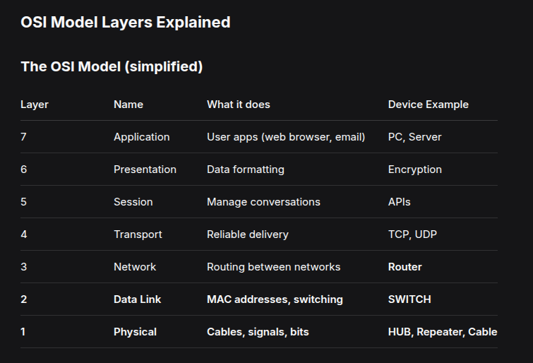
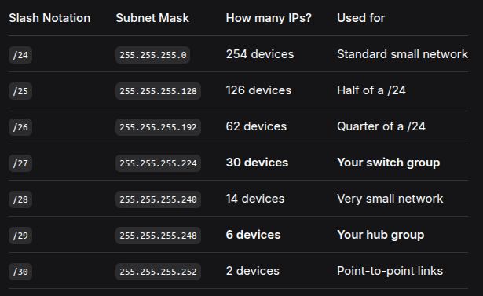
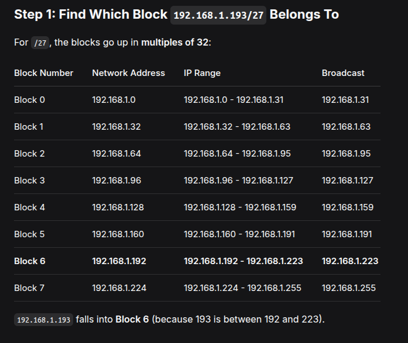
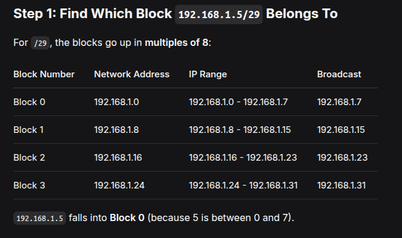

# Networking Exercises

## Exercise 1 - RJ-45 Cable

An RJ-45 (Registered Jack 45) is the standard 8-pin connector used in Ethernet networking. It's the plug/socket you see at the end of most network cables — connecting computers, switches, routers, and other network devices.

The cable itself contains 8 copper wires (4 pairs), and the connector has 8 positions (pins), which is why it's also called an **8P8C** connector.

### Straight-Through vs. Crossover

The difference lies in how the 8 wires are mapped between the two ends of the cable.

---

## Exercise 2 - Hub vs. Switch

### What is a Hub?

A hub is a simple, dumb device. When it receives data on one port, it:

1. Repeats (regenerates) the signal
2. Sends it out to **EVERY** other port (except the one it came from)

```
PC1 sends to PC2:

PC1 → Hub → PC2 ✅ (gets it)
          → PC3 ✅ (gets it too, even though it wasn't meant for them)
          → PC4 ✅ (gets it too)
```

### What is a Switch?

A switch is a smart device. It:

1. Learns which PC is connected to which port (by reading MAC addresses)
2. Creates a table (CAM table) mapping MAC addresses to ports
3. Sends data **ONLY** to the port where the destination PC is connected

```
PC1 sends to PC2:

PC1 → Switch → PC2 ✅ (gets it)
             → PC3 ❌ (does NOT get it)
             → PC4 ❌ (does NOT get it)
```

---

## Exercise 3 - OSI Model



---

## Exercise 4 - Subnetting






